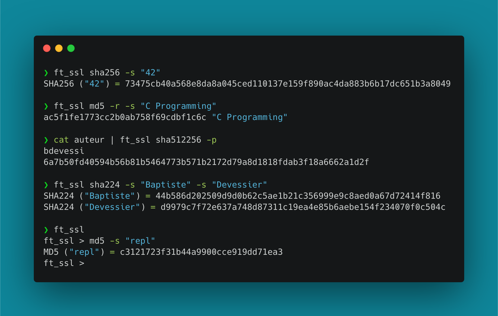

# ssl

`ft_ssl` is a clone of `openssl` with more instinctive parameters. It's a 42 School project.



ssl can be installed and used on macOS and Linux.

## Installation

You may clone the repository and build the source code.

```bash
git clone https://github.com/Devessier/ssl.git
cd ssl
make
```

You can add the binary to your path to access it outside its directory.

## Usage

Call `ft_ssl` in your terminal to launch a REPL.
This is the easiest method to test several commands.

### Message Digest commands

ssl offers seven hashing algorithms, including six from SHA-2 family.
All Message Digest commands have the same options.

#### Available algorithms

```
md5
sha224
sha256
sha384
sha512
sha512224
sha512256
```

#### Options

```
-p      Echo STDIN to STDOUT and append the checksum to STDOUT
-q      Quiet mode
-r      Reverse the format of the output
-s      Print the sum of the given string
```

#### Examples

```bash
# hash a string using MD5
$ ft_ssl md5 -s "hash this string"

# hash two strings using SHA-512 and reverse the output for the second one
$ ft_ssl sha512 -s "first" -r -s "second"

# hash a file using SHA-512/256
$ ft_ssl sha512256 file
```
